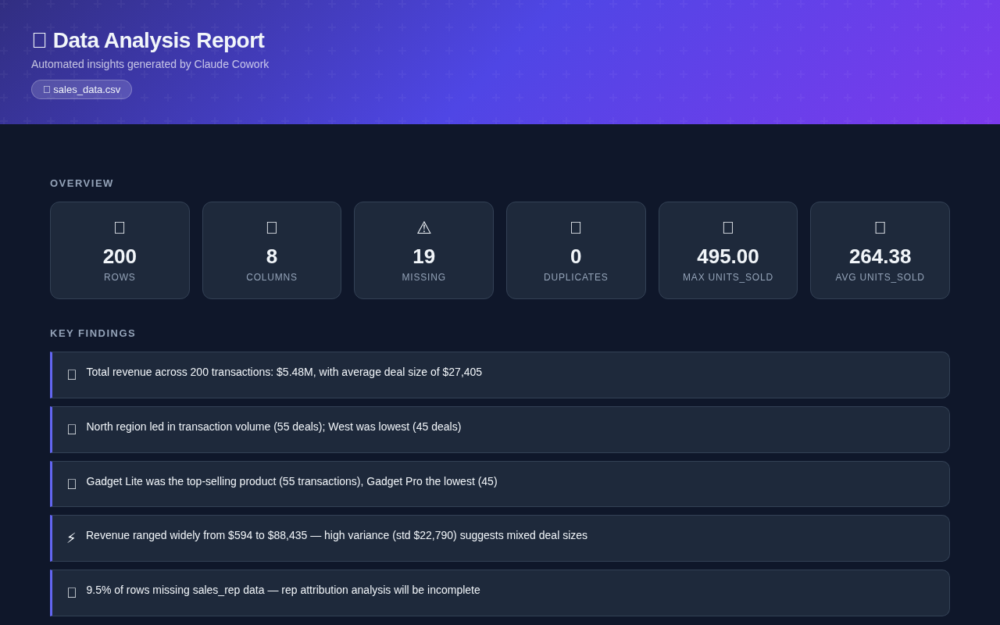

# 📊 data-analyzer

A Claude Cowork skill that turns any CSV or Excel file into a polished dark-mode dashboard report — automatically.

## What you get

- **KPI cards** — row count, columns, max and average values at a glance
- **Color-coded findings** — specific numbers and insights, not vague summaries
- **Charts** — histogram, time-series, horizontal bar, correlation heatmap
- **Statistics table** — mean, median, std dev, min, max per column
- **Categorical breakdowns** — progress bars showing value distribution
- **Data quality report** — missing values and duplicates flagged clearly

One self-contained HTML file. Opens in any browser, ready to share.

## Triggers when you say things like

- *"Analyze my sales data"*
- *"What's in this CSV?"*
- *"My boss wants a summary of this spreadsheet"*
- *"Make me some charts from this file"*
- *"Show me trends in this data"*

## Install

Download [`data-analyzer.skill`](./data-analyzer.skill) and add it to your Claude Cowork skills folder.

---

Built by [@divyanarayanan2026](https://github.com/divyanarayanan2026)
