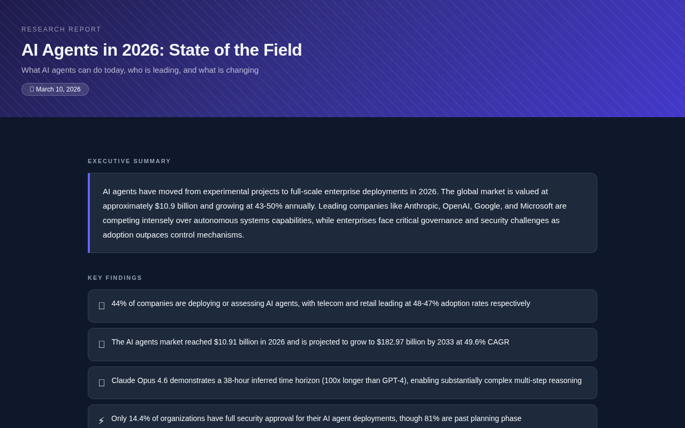

# 🔍 web-research-report

A Claude Cowork skill that researches any topic on the web and delivers a polished, sourced report — in minutes.

## What you get

- **Executive summary** — stands alone, tells the story in 3 sentences
- **Key findings** — 3–5 specific facts with numbers, not vague takeaways
- **Deep-dive sections** — synthesised from multiple real sources, not copy-pasted
- **Source list** — every claim backed with a link and date
- **Dark-mode HTML** — self-contained, ready to share

Real research across multiple search rounds. Calls out what's uncertain or contested.

## Triggers when you say things like

- *"Research X and make me a report"*
- *"What's the current state of Y?"*
- *"Give me a briefing on Z"*
- *"I need a deep dive on this topic"*
- *"Find out what's happening with X and write it up"*

## Install

Download [`web-research-report.skill`](./web-research-report.skill) and add it to your Claude Cowork skills folder.

---

Built by [@divyanarayanan2026](https://github.com/divyanarayanan2026)
